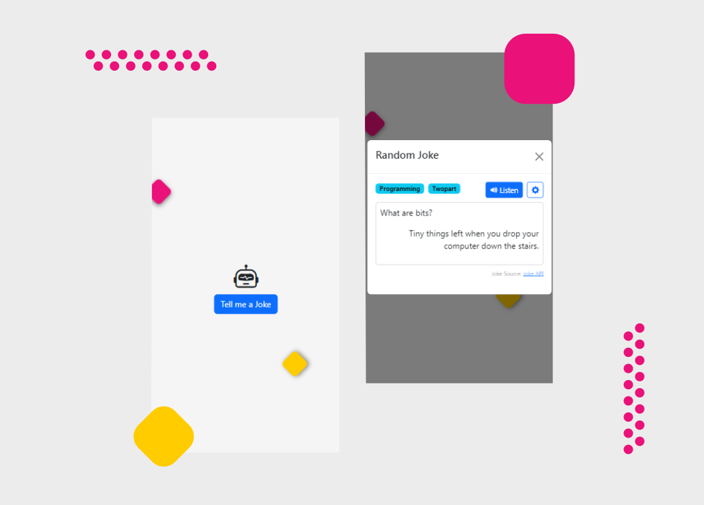

# Joke Teller React Application

## Welcome :wave: 👋



Joke Teller is a responsive react application which plays a random joke. When user click on `Tell me a Joke` button, this application makes a get request to  [Joke API]("https://sv443.net/jokeapi/v2/") to fetch random joke. And when user click on `Listen` :loud_sound: 🔊 button, application use [Web Speech API]("https://developer.mozilla.org/en-US/docs/Web/API/SpeechSynthesis") to convert the text-to-speech and play them :musical_note:🎵. Check out more accents available for your device by clicking on :gear: ⚙️ button.

Have fun ✌️	:v:

## Resources
[Joke API]("https://sv443.net/jokeapi/v2/")

[Web Speech API]("https://developer.mozilla.org/en-US/docs/Web/API/SpeechSynthesis")

* [SpeechSynthesis: voiceschanged event]("https://developer.mozilla.org/en-US/docs/Web/API/SpeechSynthesis/voiceschanged_event")
* [Getting the list of voices in speechSynthesis (Web Speech API)]("https://stackoverflow.com/questions/21513706/getting-the-list-of-voices-in-speechsynthesis-web-speech-api")

React
* [How do I conditionally add attributes to React components?]("https://stackoverflow.com/questions/31163693/how-do-i-conditionally-add-attributes-to-react-components")
* [How to use "for" html attribute in React]("https://stackoverflow.com/questions/29161330/react-js-ignores-labels-for-attribute")

JavaScript

```
let newArry = ["a", "b", "c"];

console.log(newArry[1]);         //"b"
console.log(newArry["1"]);       //"b"
console.log(newArry["01"]);      //undefined
```


> `typeof(index)` is Number and not String. But still we can tap value of certain array with either `["1"]` or `[1]`

NOTE: Read more about [Array]("https://developer.mozilla.org/en-US/docs/Web/JavaScript/Reference/Global_Objects/Array"), [Is a JavaScript array index a string or an integer?]("https://stackoverflow.com/questions/27537677/is-a-javascript-array-index-a-string-or-an-integer#:~:text=Yes%2C%20technically%20array%2Dindexes%20are,32%2D1%20are%20indexes.%22")

